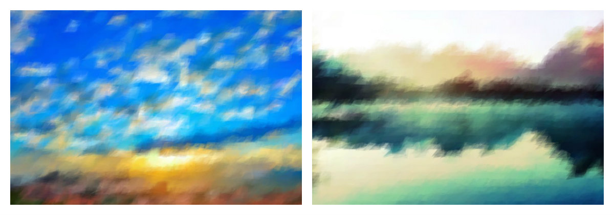
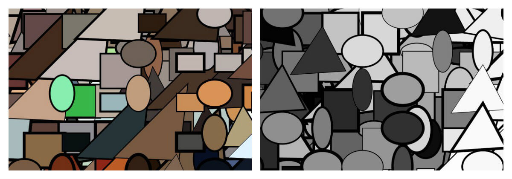
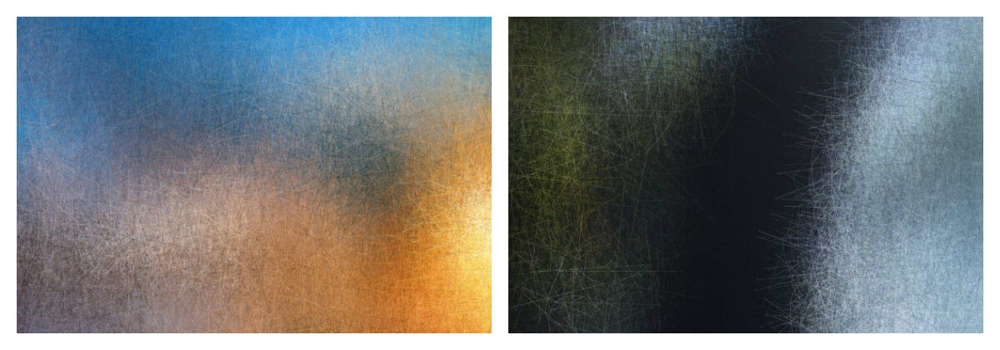

# Generative Art Filters

Generative Art Filters is a Java desktop app built with Processing that allows you to apply artistic filters to an uploaded image or to a web cam capture.

The application is organised into one primary sketch and three classes, each representing a modern art style and containing the necessary code to implement thefilter methods called in the main sketch. Two external libraries were used, the first (the user-contributed library ControlP5 by Andreas Schlegel) to aid with the construction of the user interface, and the second (the external Video library based on the GStreamer multimedia framework) to permit the user to capture an from a webcam or a camera connected to the computer.

### The Impressionism Filter
With the Impressionism class, I used the Pshape class to define a 'brush' and, using an appropriate opacity and some randomly-varied vertices, managed to generate a free brush-stroke-like effect which I felt captured something of the Impressionist style. Two methods are available: one that applies the effect to the entire canvas automatically, and a second which allows the user to apply the effect manually.
The defining points of Impressionistic paintings which I aimed to emulate with my filter were as follows:
- A free, loose brush-stroke effect.
- An emphasis on thickly applied colour at the expense of clearly defined outlines.
- An appearance or sense of the shifting of the atmosphere (or the passing of time), rather
than frozen, finely-focused detail.
- An 'unfinished' or 'raw' appearance.

Example output:

### The Cubism Filter
This class may be a misnomer, as its results may more closely resemble the Post-Painterly Abstraction movement than Cubism. In any case I think it is probably the least successful of the filters, despite being the most complex and ambitious of the three. The defining features of Cubism which I aimed to emulate with this filter were as follows:
- An abandonment of perspective.
- The use of seemingly-random shapes and planes set in a shallow space.
- A disintegration of the subject, as though 'shattered'.

Example output:

### The Abtract Expressionism Filter
With this class, I attempted to create an effect reminiscent of work such as that of Jason Pollock's, by using randomly-varied lines and bezier anchor/control points to create a frenzied spatter-like effect. As with the Impressionism class, two methods are available: one that applies the effect to the entire canvas automatically, and a second which allows the user to apply it manually. I focussed on emulating one specific style associated with the broader Abstract Expressionist movement, as what united artists of this kind was underlying motive and political views, more so than any distinct visual similarities present in their work. The defining features I limited myself to were therefore as follows:
- An energetic, frenzied feel to the strokes applied to the canvas.
- An abstract result (i.e. far removed from the concreteness of the input image).
- A focus on line and colour over form and subject.

Example output:

I was happier with the aesthetic effect produced by this third filter more so than with any of the others.
